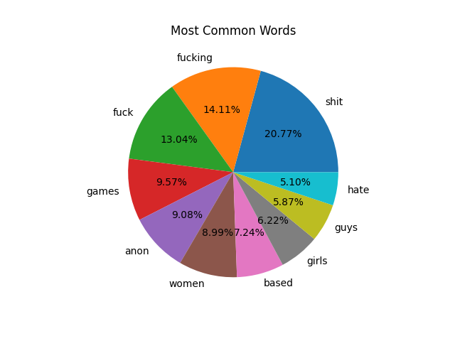
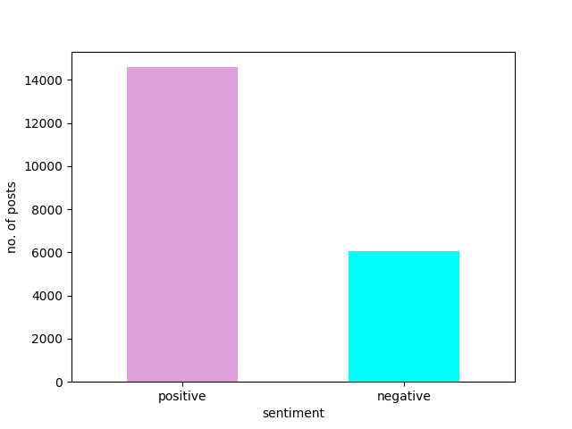

#  4chan text mining

 Webscraper + basic text mining.

<h2>The dataset is uploaded to Kaggle as well</h2>
<a href='https://www.kaggle.com/datasets/discordspy/4chan-posts-from-all-boards-20645-posts'>https://www.kaggle.com/datasets/discordspy/4chan-posts-from-all-boards-20645-posts</a>
 
<h2>Run webserver (basic web gui)</h2>
<pre>
pip install -r requirements.txt 
python app.py
</pre>

<h2>Word Frequency</h2>

<h2>Sentiment analysis </h2>
